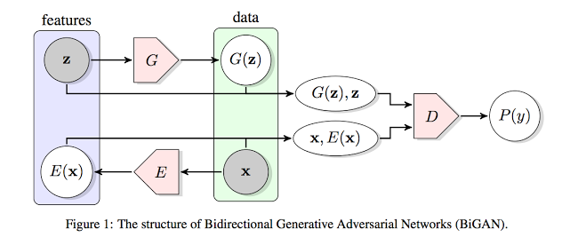

# [Adversarial Feature Learning](https://openreview.net/pdf?id=BJtNZAFgg) 

by: **Jeff Donahue, Philipp Krahenbull, Trevor Darrell (University of California, University of Texas)**

##tl;dr

Typical GANs are generative models that learn to map a latent representation (f.i. a random 1d vector) to a potentially complex data distribution (f.i. images), but haven’t the ability to map data to this representation to perform unsupervised feature representation (which is for example useful for unsupervised clustering). BiGANs are special GANs that learn this inverse mapping.

##Notes

Application of GANs : make plausible semantic variations via interpolations in the latent space

Other option (than BiGANs) is to learn p(z | G(z)) as an inverse mapping. Called latent regressor. 
Difficult because implies for G to model with extreme precision the data distribution...

BiGANs :
an encoder maps the input data to a latent representation
D discriminates in both data space (x vs G(z)) and latent space (z vs E(x))
no communication between E and G   ->   E(G(z)) never computed

Training scheme is the alternating gradient approach developed by Goodfellow in the GAN paper ; but D, G, E are updated simultaneously

BiGANs are only suitable because in the optimal set of model parts (G, E, D), G and E learn to inverse each other.

Swapping real and generated labels Y provides stronger gradient (see Goodfellow et al 2014)

Generalized BiGAN (for high-dimensional data) : encoder use higher resolution inputs, while generator input and discriminator output are lower resolution

self-supervised learning : using data’s natural structure (f.i. patch organization in images) as a means to do supervised learning in an unsupervised way (f.i. predict location of a patch around a center patch in an image) 
see [this paper](https://arxiv.org/pdf/1505.05192.pdf) for more info