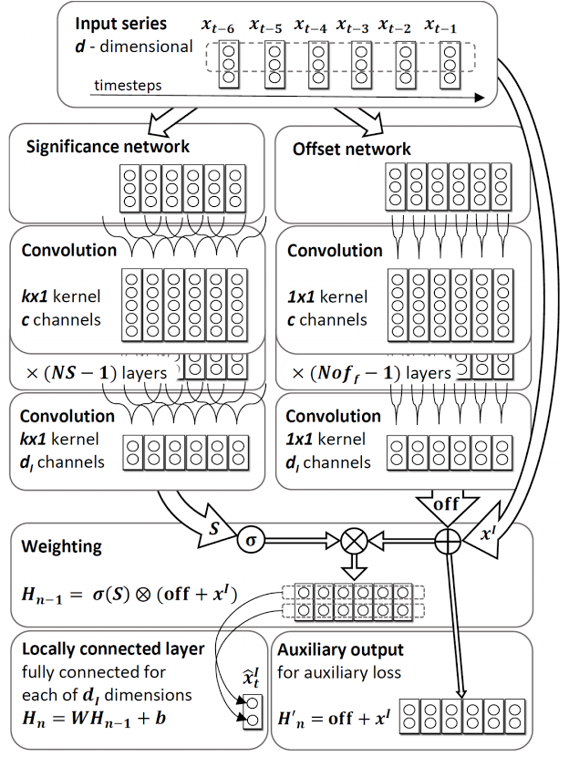
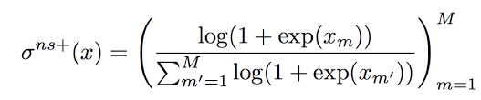

#[Autoregressive ConvNets for Asynchronous Time Series](https://arxiv.org/pdf/1703.04122.pdf)

by: **Mikołaj Binkowski, Gautier Marti and Philippe Donnat (Imperial College, Ecole Polytechnique, Hellebore Capital)**

##tl;dr

AR-like system performing regression for asynchronous time series that presumably present low signal-to-noise ratio and are multivariate.
Weights are learned via ConvNets and the final predictor is a weighted sum of sub-predictors.

##Notes
 
autoregression = modeling the mean of the distribution of the future observations, conditioned on some observed data

idea = coupling classical non-parametric linear models with DL models that are able to exhibit fine-grained patterns

Gaussian processes used as ML approach for time series regression

**SOCNN (Significance-Offset CNN)**

 

two trained networks :
an offset network : equivalent to a collection of separate predictors for the |I| variables values to predict
a significance network : outputs weights that are used to weigh the different predictors independently for each variable

two losses :
an auxiliary loss : the mean difference between subpredictors’ predictions (offsets) and the ground truth (offset between x[t-i] and x[t])
a main loss : the squared error + alpha * the auxiliary loss

an original normalizing activation : *normalized softplus*

**Experiments**

* used leaky ReLU with alpha = 0.1
* small learning rates (0.001)
* early stopping : patience of 5 epochs, no improvement results in 10x decrease and best weights reinitialized, stops after 3 reductions
