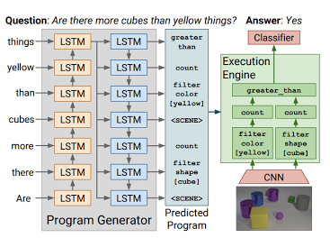

# [Inferring and Executing Programs for Visual Reasoning](https://arxiv.org/pdf/1705.03633.pdf)
by: **Justin Johnson, Bharath Hariharan, Laurens van der Maaten, Judy Hoffman, Li Fei-Fei,  C. Lawrence Zitnick, Ross Girshick (Stanford University, Facebook AI Research)**

## tl;dr
Traditional Visual Reasoning consists in mapping an input to an output using a black-box architecture, thus without modeling the underlying reasoning process. The paper uses a model with a program generator (modeling this reasoning process) and an execution engine (that executes the program and generates an answer). Both components are neural networks trained via backprop + REINFORCE.

## Notes 

requirement for a general visual intelligence is composition : should be able to decompose ‘person touching a bike’ by composing knowledge of ‘person’, ‘bike’ and ‘touch’

models mapping input to output on VQA exploit dataset biases instead of reasoning

* have a hard time on challenging dataset CLEVR
* CLEVR gives as info reasoning needed to answer question
* exploiting only 2% of the reasoning supervision, this approach outperforms non-compositional state-of-the-art by ~20% !!

program generator and execution engine can be either learned separately (if intermediate labels available) or end-to-end
generalizes to novel questions requiring unseen module composing -> evaluated thanks to user-generated questions (with oov words) and finetuning without supervision

**programs**

programs generated have a syntax and semantics (as a classical programming language would) 
syntax is fixed by fully specifying set F of functions that accept 1 or 2 parameters 
special word/constant Scene = visual features of image
valid programs are syntax trees where each node is a function in F

**program generator**

standard LSTM seq2seq model turning questions into sequence of words
decoding = taking the argmax at each time step (no Viterbi)
sequence of words = sequence of functions of the syntax tree
syntax tree is easily obtained since arity of functions is known
sequences too short are padded with Scene constants
                  too long -> discard unused functions

**execution engine**

engine is given a program z and an image x
program z is used to assemble a question-specific NN from a set of modules
each function f is mapped to NN block m(f) ; outputs of children (in the tree) are used as inputs of parent modules

modules have generic architectures :

* each n arity func takes n CxHxW features maps and output a CxHxW feature map
* each unary func is a residual block (standard) with 2 3x3 conv
* binary modules concatenate inputs to form 2CxHxW feat map, project to CxHxW with a 1x1 conv, and feed to a residual block
* Scene takes visual features as input, process them with 4 conv layers, and output CxHxW feature map -> visual features are conv4 features from ResNet101

final feature map is given to a MLP to produce distrib over possible answers

**training**

cannot backprop through argmax operations in program generator
-> replace argmax with sampling and use REINFORCE to estimate gradients, with rewards as zero/one loss of the execution engine

pb : joint training (program gen and exec engine) with REINFORCE is hard !

semi-supervised approach :

* small set of ground-truth programs to train prog gen
* fix prog gen
* train exec engine on large dataset
* use REINFORCE to finetune jointly

