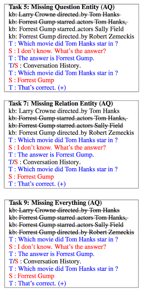

#[Learning through Dialogue Interactions by Asking Questions](https://openreview.net/pdf?id=rkE8pVcle)

##tl;dr

A dialogue agent should be able to both answer and ask questions, and learn from both scenarios. With this kind of interactions and offline/online approaches, the learner benefits from asking questions. 

##Notes 

human way : when poor confidence about an answer to give, ask intermediate questions to clarify

typical dialogue systems learn to give a fixed answer

* big limitations : unknown words, complicated sentences, unseen structure...
* poor performance on those cases

several categories of mistakes for the learner

* problem understanding phrase structure
* problem with reasoning : cannot link knowledge to question
* problem with knowledge : do not have access to knowledge required to answer

two approaches : offline and supervised 
     VS 
     online and RL

chit-chat or end-to-end dialogue systems 
≠ 
goal-oriented dialogue systems (e.g. booking ticket, making reservation...)

extends work from
Weston (2016) : learning through conducting conversations in which supervision is part of the responses

* imitation learning : imitating interactions between teacher and expert student
* reward-based imitation learning : imitating interactions with good answers
* forward prediction : predicts teacher feedback to student

**tasks**

They represent situations which motivate bot to ask questions.
question clarification : when bot has problems understanding question
knowledge operation : when bot needs help to perform reasoning on KB
knowledge acquisition : bot’s knowledge is incomplete and needs to be filled
dataset : WikiMovies = 100k questions over 75k movies based on OMDb (open movie db)

setup : bot has access to 
controlled quantity of facts from OMDb KB
conversation histories = teacher/bot interactions unrelated to question
two settings : QA and AQ (asking question)
-> in both learner has to provide answer to question in the end

*question clarification*

special case : misspelling induced to prevent bot from understanding question
/!\    different misspelling schemes in train/valid/test to make sure misunderstanding
2 AQ tasks
question paraphrase = bot asks teacher to use paraphrase without misspells
(‘what do you mean ?’, feedback = ‘I mean xxx’)
question verification = bot produces typo-free question equivalent and asks teacher if ok
(‘do you mean xxx ?’ feedback = ‘yes/no’)

*knowledge operation*

ask for relevant knowledge = bot asks teacher to point relevant fact
knowledge verification = bot asks teacher if question is relevant to a particular KB fact

*knowledge acquisition*

T/S denotes 5 pairs of unrelated questions / answers

**training / testing**

goal twofold : evaluate usefulness of asking questions
                      evaluate if student learns when to ask questions

*offline supervised learning*

model is trained in the reward-based imitation learning way : tries to reproduce good answers of a fixed policy student bot (that asks and answers questions correctly 50% of the time) -> maximize log-likelihood of good answers
three settings : 

* TrainQA (bot does not ask question and answers directly)
* TrainAQ (bot asks one question before answering) 
* TrainMix (asks question 50% of the time)

/!\ in all cases bot answers question in the end

During tests, perfect policy used : questions asked are correct 100% of the time
TestQA, TestAQ, TestModelAQ (has to get question correct as well)

Model used is MemNN or Context MemNN

Context MemNN : word embedding is set to context embedding (average embedding of context words), it outperforms vanilla MemNN

For TestModelAQ, the bot must ask a question : use a MemNN as well

Forward Prediction is also used : bot tries to predict teacher feedback

*online RL*

model learns the ability to choose when to ask question -> learns how to learn
/!\ necessity to penalize the use of questions (bot always asking questions is not optimal)
penalty = cost(AQ) in [0, 2]    (models teacher’s patience)

decision whether to ask = binary policy
gradients approximated via REINFORCE 
-> if final answer is correct +1 else -1 (indep. of whether question asked or not)

different behaviours :
good student = all KB facts + no misspellings
poor student = not all KB facts + misspellings
medium student = 50% good student + 50% poor student

Model for binary policy is binary vanilla-MemNN, learned through REINFORCE

**Conclusions**

TrainAQ + TestAQ outperforms TrainQA + TestQA by large margin
Cont-MemNN outperforms Vanilla-MemNN by large margin again

