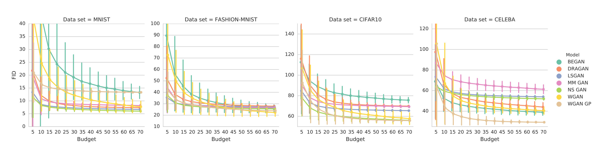
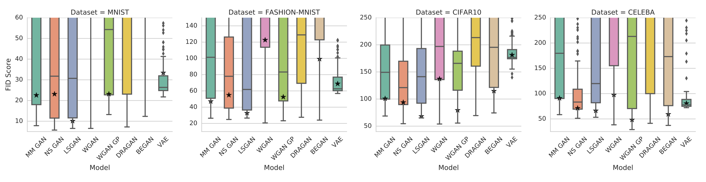

# [Are All GANs Created Equal ? A Large-Scale Study](https://arxiv.org/pdf/1711.10337.pdf) 

by: **Mario Lucic, Karol Kurach, Marcin Michalski, Sylvain Gelly, Olivier Bousquet (Google Brain)**

## tl;dr

A large-scale study underlining the need for more principled experiments in generative model research (with a focus on GANs).

It shows that supposedly improved versions of GANs wrt to the original model fail in practice to consistently outperform this baseline : in fact the performance gap is dataset-dependent and is overestimated due to unsufficient hyperparameter optimization.

Moreover, it shows that GANs performance is not invariant to random seed and not at all to hyperparameter changes. Thus, different versions of GANs cannot be compared properly unless dedicating a big computational budget to hyperoptimization.

## Notes

#### About the quality of generative models

GANs are compared using the Inception Score (IS) or the Fréchet Inception Distance (FID), both applying a pre-trained classifier on the generated data.

**IS**

Looks at post-softmax classification distributions.

Maximal for generated data that has a high-entropy expected output distribution (all classes represented equitably) and low expected entropy outputs (produces samples whose class is distinct for the model).

Measured with KL divergence in practice.

**FID**

Looks at a given layer embedding classification distribution.

Fits multivariate Gaussians to real data and generated data embedding and compares them using Fréchet distance (curve distance metric).

The authors show that FID is sensitive to mode dropping (classes not represented), has low variance (when comparing two subsets of the same dataset), and is not sensitive to using a different classifier.

Both measures do not detect overfitting and are maximal for a Memory GAN (that simply randomly reproduces images of its training dataset).

#### Experiments

Models compared : original GANs (MMGAN, NSGAN), novel ones (WGAN, DRAGAN, LSGAN...) and the variational autoencoder

Datasets : MNIST, Fashion-MNIST, CIFAR10, CelebA, Triangles

**Result 1**

When given too small of a budget to hyperoptimize generative models, all achieve similar minimum FID.

**Result 2**

Performance of all GAN algorithms is very sensitive to hyperparameter choices, with no model being more stable than others, as shows the figure :

#### Conclusion

* experiments should report mean performance instead of best one
* high precision, recall and F1-score on a toy dataset is a desirable property
* original GANs is not consistently worse than newer counterparts

#### Code

goo.gl/G8kf5J