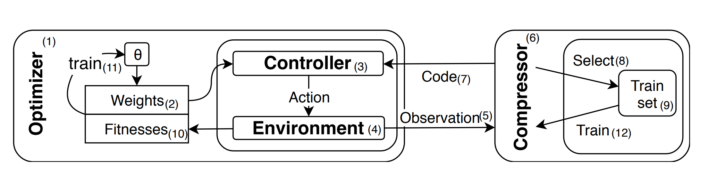
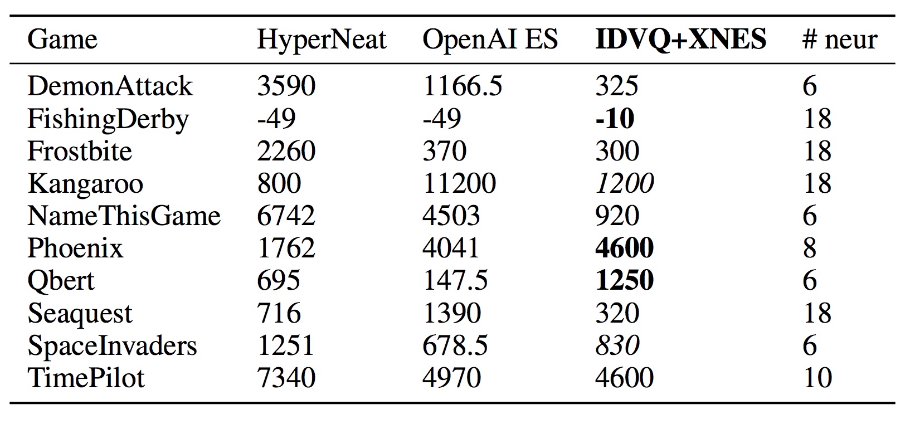

# [Playing Atari with 6 Neurons](https://arxiv.org/pdf/1806.01363.pdf) 

by: **Giuseppe Cuccu, Julian Togelius, Philippe Cudré-Mauroux (eXascale Infolab, NYU)**

## tl;dr

Obtain relatively good scores on Atari games on a very tight budget (1 single multicore CPU workstation). They decouple the input representation task from the action taking one and use a neuroevolution algorithm to learn the weights of the policy network.

## Notes

**Input representation**

Input representation turns ALE outputs to a sparse binary code that is fed to the policy network. 

The input representation part uses dictionary learning : they decompose these big images into a sum of same dimensionality images called centroids. 

Contrary to the classical dictionary learning setting, perfect reconstruction is not the goal here, instead they aim to give enough information to the policy network to choose the best action possible. With that in mind, they design Direct Residuals Sparse Coding (DRSC) which iteratively chooses the centroid that is the most similar to the input and adds its index to the code. 

The dictionary (set of centroids) is learned online during training as well, via Increasing Dictionary Vector Quantization (IDVQ) : a residual (diff. between input and reconstruction though code) is added to the dictionary if its norm is superior to a fixed threshold.

**Taking actions**

The controller (aka policy network) is a no-hidden layer RNN which has as many neurons as the game requires different actions.

Its weights are trained via XNES (Exponential Natural Evolution Strategies). 

Since the size of the dictionary (and thus the size of the code) evolves along the epochs, the topology of the network changes as well : 0-initialized weights are concatenated to the current weights to manage that.

**Exponential Natural Evolution Strategies**

XNES learns weights while maintaining their underlying distribution.

It is different from other Evolution Strategies methods because it scales the updates in parameters by the inverse of the Fisher matrix. 

The Fisher matrix is the second derivative of the KL divergence of a distribution wrt to itself and can be interpreted as a local distance metric between distributions. 

When multiplied with a gradient, it gives the natural gradient, which scales every update based on the change in the params distribution it represents. 

It is useful because we want to maintain a distribution on params.

Exploration is performed by injecting gaussian noise in the current weights and evaluating the resulting config.

**The agent**

#### Results

HyperNeat uses one hidden layer with 336 neurons, while OpenAI ES uses two hidden layers with 64 neurons.

The proposed method does not use any hidden layer.  

#### Code

https://github.com/giuse/DNE/tree/nips2018
