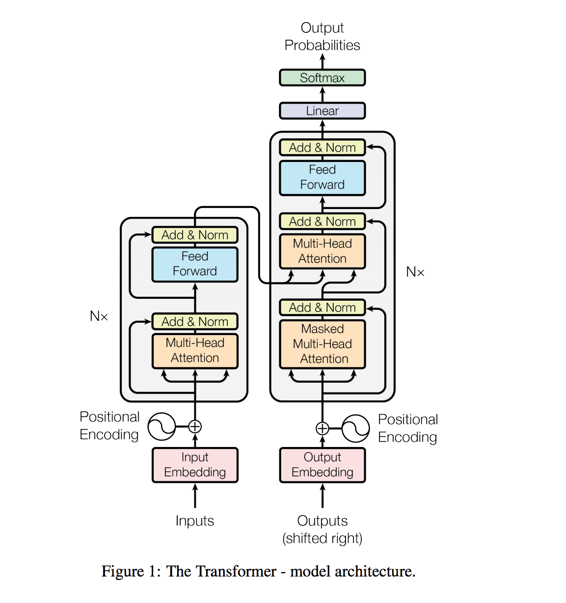

# [Attention is all you Need](https://arxiv.org/pdf/1706.03762.pdf) 

by: **Ashish Vaswani, Noam Shazeer, Niki Parmar, Jakob Uszkoreit, Llion Jones, Aidan N. Gomez, Łukasz Kaiser, Illia Polosukhin (Google Brain & Research, University of Toronto)**

## tl;dr

State-of-the-art machine translation sequence-to-sequence model that does not use neither convolutions nor recurrent cells, thus resulting in a way cheaper training cost. 

## Notes

Sequentiality of RNNs does not allow for parallelization, and long-range dependencies are tricky to obtain. Plus, it does not do a good job to model hierarchies, despite efforts such as Tree-LSTMs.

ConvNets parallelize very well, and many recent efforts showed that it is possible to get very good performance out of them. In general, there is still a caveat : tokens access information from other tokens at a log cost (with dilated causal convolutions).

In contrast, attention mechanisms, which are widely used in high-performance solutions, access tokens at a constant cost. The authors show that it can replace sequence-aligned recurrence.

#### The Transformer architecture

Embeddings are augmented with positional information that encodes information about the position of tokens in the sequence. Indeed, contrary to ConvNets or RNNs, the Transformer does not have access to that information by default.  

The encoder is composed of 6 identical layers. Each of them is an attention-augmented encoding of the previous layer information, followed by a MLP projection.

The decoder is composed of 6 identical layers. Each of them is an attention-augmented encoding of the previous layer information, followed by an other attention-augmented mixing of current output and encoder output, and an MLP projection.

#### Attention mechanisms

Three types of attention settings here :

* self-attention for the encoder
* masked self-attention for the decoder
* encoder-decoder attention

Here, since no convolutional or recurrent component is used, attention is a way to encode the surrounding information of each token.

The basic block of the attention mechanism is the Scaled-Dot Product Attention that works as weighted sum of all the inputs, whose weights are based on token similarities.

The attention mechanism here is Multi-Head Attention, which concatenates k blocks consisting in a linear projection followed by Scaled-Dot Product Attention. Each block can learn different attention associations between inputs, which makes the model richer. 

#### Additional resources

The paper annotated with code blocks and remarks :

http://nlp.seas.harvard.edu/2018/04/03/attention.html 

#### Code

https://github.com/tensorflow/tensor2tensor