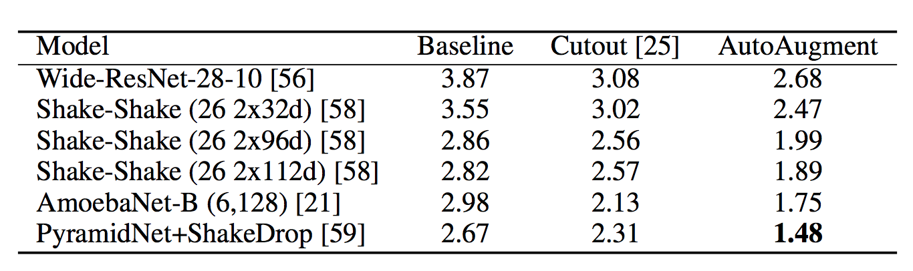

# [AutoAugment : Learning Augmentation Policies from Data](https://arxiv.org/pdf/1805.09501.pdf)

by: **Ekin D. Cubuk, Barret Zoph, Dandelion Mané, Vijay Vasudevan, Quoc V. Le (Google)**

## tl;dr

Use Reinforcement Learning on a RNN controller to search for the best augmentation policy for supervised and semi-supervised image classification. Obtain SOTA performance on CIFAR10, CIFAR100, SVHN and ImageNet (supervised) and close to semi-supervised SOTA on reduced datasets without using unlabeled data.

## Notes

#### Augmentation Policies

Policy = ensemble of 5 subpolicies.

Subpolicy = two image transformations with magnitude and proba of application.

Image transformations used are taken as-is from the PIL Python package for image manipulation. They include shearing, translation, rotation, as well as modification of contrast, brightness, color, sharpness and others.

Cutout, which simply consists in sampling a square portion of the image and setting all pixels to an average value, is added on top of the image transformations learned. It is a powerful regularization scheme that was shown to consistently improve image classification performance.

#### Learning a controller

A controller RNN is trained via RL to improve a policy. It outputs 30 probability distributions (5 subpolicies * 2 img transfos * (operation type, proba, magnitude)). Its rewards are the increase in performance of a child image classification model trained on a subset of the whole dataset.

The policy derived is then evaluated on a new model trained on the whole dataset for a larger amount of time.

The joint search space of the 5 subpolicies has an order of 10^32 possibilities !

The RL algorithm to train the RNN agent is PPO.

#### Results

At test time, they use a standard baseline preprocessing (optional)  + an ensemble of the 5 best policies as their final data augmentation process (so 25 subpolicies !).

Policies and subpolicies are sampled randomly for each data point in each minibatch.

On CIFAR10 :

Interesting things : 

* Geometric transformations (shearing) are almost never picked up.
* Policies learned transfer well on new datasets and different architectures !
* The performance increases with the amount of subpolicies learned, but only up to a certain point.

#### Remark

They do not mention proper SOTA on semi-supervised learning (Mean Teachers)...