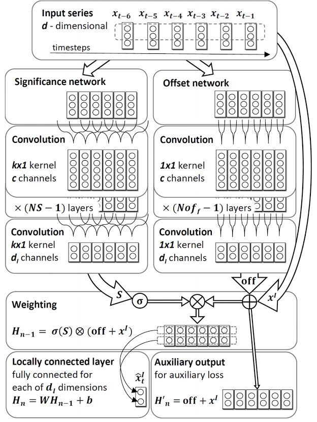

# [Autoregressive ConvNets for Asynchronous Time Series](https://arxiv.org/pdf/1703.04122.pdf)

by: **Mikołaj Binkowski, Gautier Marti and Philippe Donnat (Imperial College, Ecole Polytechnique, Hellebore Capital)**

## tl;dr

AR-like system performing regression for asynchronous time series that presumably present low signal-to-noise ratio and are multivariate.
Weights are learned via ConvNets and the final predictor is a weighted sum of sub-predictors.

## Notes
 
Autoregression = modeling the mean of the distribution of the future observations, conditioned on some observed data.

Traditionally, Gaussian processes are used as the standard ML approach for time series regression.

Their idea is a combination classical non-parametric linear models with DL models that are able to exhibit fine-grained patterns.

**SOCNN (Significance-Offset CNN)**

Two trained networks :

* the Offset network : equivalent to a collection of separate predictors for the |I| variables values to predict
* the Significance network : outputs weights that are used to weigh the different predictors independently for each variable

Two losses :

* the auxiliary loss : the mean difference between subpredictors’ predictions (offsets) and the ground truth (offset between x[t-i] and x[t])
* the main loss : the squared error + alpha * the auxiliary loss

They use an original normalizing activation : *normalized softplus*

#### Experiments

* used leaky ReLU with alpha = 0.1
* small learning rates (0.001)
* early stopping : patience of 5 epochs, no improvement results in 10x decrease and best weights reinitialized, stops after 3 reductions
