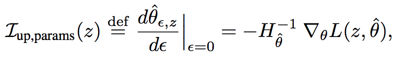
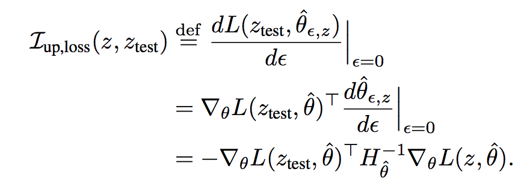
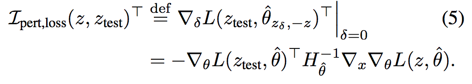

# [Understanding Black-box Predictions via Influence Functions](https://arxiv.org/pdf/1703.04730.pdf)

by: **Pang Wei Koh, Percy Liang (Stanford)**

## tl;dr

Use Influence functions to clarify model predictions.
Different from traditional interpretability methods since it traces influence back to training data, requiring vectors and Hessian. Useful to understand model behavior and detect dataset errors.

## Notes

Standard local interpretability methods :

* fit a locally faithful model that is interpretable (e.g. LIME)
* perturb the point and assess how the prediction is affected (e.g. saliency maps)

does not explain on which training data the model relies to predict.

Influence functions are estimators of the change for the model parameters if we were to retrain it while giving a training point a slightly higher weight.

The assumptions for the learned task (which are quite **strong**) are that the empirical risk is twice-differentiable and strictly convex in the model parameters, but they show that their method still provides useful insights in non-convex settings.

**Upweighting a training point**

Intuitively we want to measure the influence of the removal of training points for the loss function.

Could study change in model parameters via retraining without a certain point but would be incredibly costly.

Influence functions allow us to approximate the effect of the upweighting of a point on model params :

The removal of a point is equivalent to its upweighting by -1/n.

Use of chain rule allow us to get influence of upweighting for functions of the model parameters :

**Perturbing a training input**

Almost same process. 

Useful to craft adversarial examples or define important features for a test prediction.

**Relation to Euclidean distance**

LIME chooses training points that are most relevant to a particular point as nearest neighbors wrt to a Euclidean distance.

For a logistic regression, using the influence of upweighting a point has two main differences :

* gives points with high training loss a higher influence via misclassification term
* weighted scalar product (loss grad on ztest * hessian-1 * loss grad on z) gives higher influence to points whose perturbation do not affect training performance (inverted hessian measures resistance to change for training points) and whose perturbation affects prediction for ztest

