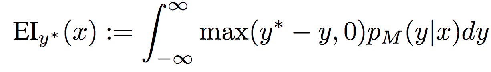
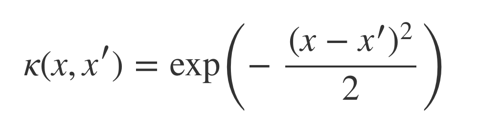
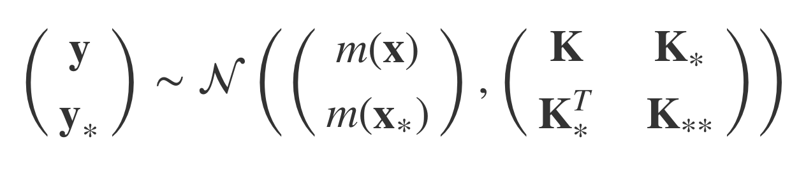
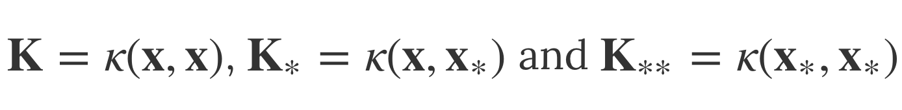
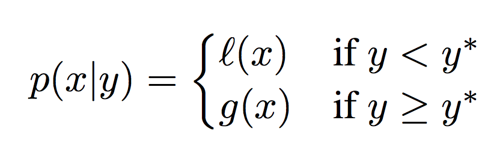

# [Combining Hyperband and Bayesian Optimization](https://bayesopt.github.io/papers/2017/36.pdf) 

by: **Stefan Falkner, Aaron Klein, Frank Hutter (University of Freiburg)**

## tl;dr

Getting the best of both worlds in neural network hyperoptimization with a clever combination of the anytime-good performance of Hyperband and the asymptotically-optimal performance of Bayesian optimization.

## Notes

These notes serve a dual purpose : summarizing the article in a clear way and writing down what I learned about Bayesian optimization in the process.

#### A primer on Bayesian optimization

**1. Sequential-Model Bayesian optimization (SMBO)**

Bayesian optimization is about minimizing a blackbox function whose (costly to evaluate) outcome depends on some hyperparameters. In our case the function is our neural net performance on validation data (with a minus for we look for a minimum). This requires an initial rough guess of the model performance for a set of hyperparameters (eg. *the prior*), which is used in combination to actual assessment of hyperparameters to get a better guess (eg. *the posterior*) via sequential improvements.

So the classical steps for SMBO are :

* initialize a prior (1)

and then repeat :

* sample a new set of hyperparameters (2)
* evaluate the function (3)
* use the result to update the posterior (4)

until no relative improvement is observed.

(1) initial prior = uniform. SMBO starts as a Random Search in the first couple of iterations, to kickstart the probabilistic model. Features search spaces can be defined as uniform, log-uniform or discrete.

(2) choose the set of hyperparameters that maximizes Expected Improvement (EI) over the best result observed (y*):

EI is a compromise between exploitation (regions where average expected result is close to y*) and exploration (under-explored regions where uncertainty is high).

The search could be done as an exhaustive Grid Search over the hyperparameter space, but in practice an evolutionary algorithm (CMA-ES) is used. 

(3) straightforward

(4) typically, the posterior is modelled using a Gaussian Process or a Tree-Structured Parzen estimator (see next subsections). The probabilistic model fits again the history data after each evaluation. 

**2. Gaussian Processes (GP -> Spearmint, SMAC)**

See this [blog post](http://bridg.land/posts/gaussian-processes-1) for an introduction on Gaussian Processes.

Each data point is modelled as a random variable. 

A function is approximated as a multivariate gaussian whose dimensionality is equal to the amount of data points in the dataset.

This gaussian is usually centered and uses a kernel function to define its matrix of variance/covariance. The kernel function plays the role of a prior on the geometry of our data distribution : for instance, the squared exponential kernel 

implies that close data points are very likely to share the same class.

Let's now use training data for learning. We start by modelling the joint distribution of observed and unobserved data :

where

Then, we can condition on the observed data to obtain what we want : the posterior distribution !

(*insert more details*)

Gaussian Processes are valuable because they don't need a huge amount of data to show useful performance and they provide an uncertainty over each prediction. Moreover, it is light enough so that model evaluation dominates to global cost of hyperoptimization.

**3. Tree-Structured Parzen Estimator (TPE -> hyperopt)**

When GPs model the posterior p(y|x), TPE models both p(x|y) and p(y).

The former is modelled this way :

l(x) and g(x) are Gaussian Mixture Models (GMM) : l(x) fits one GMM to the set of hyperparameter values associated with the smallest loss function values, g(x) fits another GMM to the remaining hyperparameter values.

The next set of hyperparameters sampled is the one that maximizes l(x) / g(x).

The advantage of TPE is that it natively supports conditional hyperparameter spaces : for instance, the number of layers of a neural net conditions the search for the optimal amount of neurons, because a one-layer MLP does not need to define the amount of second or third layer neurons.

#### Hyperband

Hyperband improves on Successive Halving, a simple but effective method to hyperoptimize SGD-based processes. 

Successive Halving works following the intuition that a near optimal set of hyperparameters is more likely than not going to have smaller loss values than other sets of hyperparameters. Thus, it allocates a small budget B to N configurations. After B iterations, epochs or minutes, it keeps the better half of the configurations and doubles their budget, and so on until one configuration remains.

The big drawback of Successive Halving is that one has to provide both B and N values and it can be unclear whether N should be large or small, since it has a huge influence on the average training time allocated to a configuration.

Basically, Hyperband tries many different tradeoffs between B and N to find the optimal one, while keeping their product constant. It performs a geometric search on the average training time allocated per config. It takes two parameters as input : R, the maximum amount of resource allocated to one config and η, the proportion of configs discarded in each loop of Successive Halving.

Note : Dataset subsampling could be used as an additional way of allocating / deallocating budget !!

The configs are sampled via Random Search.

See [Hyperband paper](https://arxiv.org/pdf/1603.06560.pdf) for more details. 

#### HB-BO

It is the same heuristic than in Hyperband, except that configs are sampled using SMBO. The procedure starts with the lowest budget and first evaluates configs drawn randomly. When having enough of them, a model (a multivariate KDE) is fitted and configs are sampled from it following the sampling mechanism of TPE. For higher budgets, there is a probability p that a config is drawn randomly, otherwise it takes the highest budget having enough configs tested and samples from the according model.

#### Code

Not released yet.

**Work in progress !**