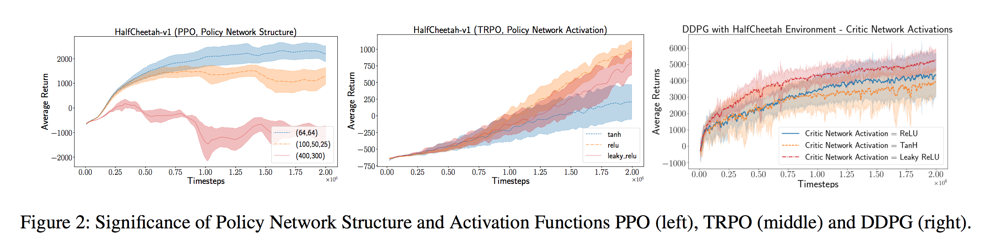

# [Deep Reinforcement Learning that Matters](https://arxiv.org/pdf/1709.06560.pdf) 

by: **Peter Henderson, Riashat Islam, Philip Bachman, Joelle Pineau, Doina Precup, David Meger (McGill University, Maluuba)**

## tl;dr

Deep RL paper results can be hard to reproduce. Is it only because algorithms are hard to implement in the right way ? The authors conduct experiments and show that several well known algorithms show variable performance when exposed to what could appear as minor changes in hyperparameters, network architecture or even random seeds ! The study underlines the strong need for reproductibility, open-source code and models as well as more carefully designed experiment reports in papers.

## Notes

The algorithms benchmarked are model-free policy gradient methods that use MLPs as function approximators : 

* PPO (Proximal Policy Optimization)
* TRPO (Trust Region Policy Optimization)
* DDPG (Deep Deterministic Policy Gradients)
* ACKTR (Actor Critic using Kronecker-Factored Trust Region)

Two tasks : Hopper-v1 and HalfCheetah-v1 from OpenAI Gym

#### On hyperparameters

Hyperparameters choice is not consistent in the literature.

Moreover, the range of hyperparameters tested should be explicited in papers.

#### On network architecture

Performance can vary greatly due to number of neurons and layers and type of activation.

The choice of the architecture defines the set of optimal hyperparams (learning rate, clipping thresholds) and must be well thought.

#### On reward scale

The reward can be multiplied by a fixed scalar or clipped in order to concentrate the output scale of the value function network and facilitate learning.

Heavy influence on average return.

#### On seed variance

RL algorithms are famous for their performance variance.

They show that it can lead to misinformed conclusions : for instance, two sets of 5 random seeds can have disjoint result distributions !!

Papers should not use few random seeds (< 5 has been observed) and should not manually select the best ones (observed as well).

#### On code itself

Extremely interesting experiment : they took several released implementations of the same algorithm and benchmarked them on the same task.

When reimplementing an algorithm, one should always make sure the performance of the original paper is replicable.

#### Code

https://github.com/Breakend/DeepReinforcementLearningThatMatters