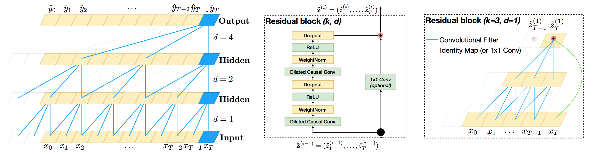

# [An Empirical Evaluation of Generic Convolutional and Recurrent Networks for Sequence Modeling](https://arxiv.org/pdf/1803.01271.pdf) 

by: **Shaojie Bai, J. Zico Kolter, Vladlen Koltun (Carnegie Mellon, Intel Labs)**

## tl;dr

TCN is a fully convolutional architecture that outperforms RNNs, GRUs and LSTMs at sequence modeling tasks (f.i. adding binary elements, sequential MNIST, char or word-level language modeling...) while being parallelizable, avoiding vanishing / exploding gradients and having a flexible receptive field.

Its architecture leverages recent proposals such as dilated causal 1D-convolutions inside residual blocks and is helped by adding weight normalization, gradient clipping and spatial dropout (dropping feature maps).

## Notes

#### Architecture

#### Results

#### Code

https://github.com/locuslab/TCN