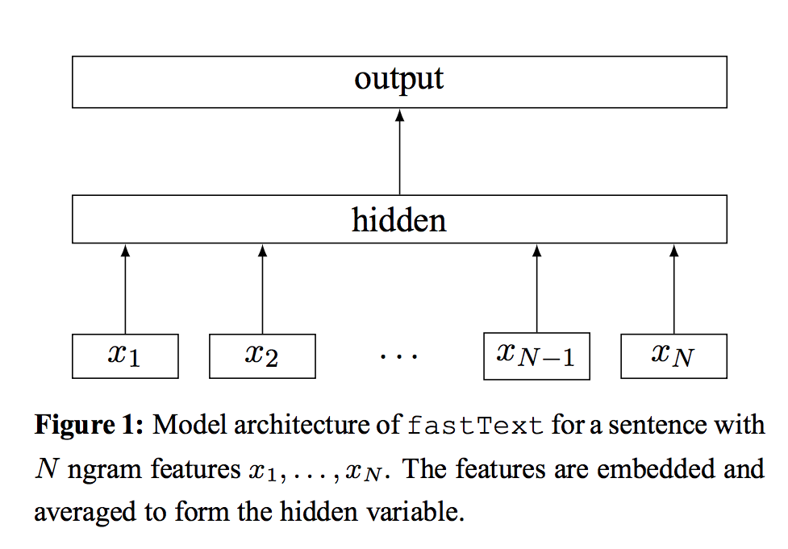

# [Bag of Tricks for Efficient Text Classification](https://arxiv.org/pdf/1607.01759.pdf)

by : **Armand Joulin, Edouard Grave, Piotr Bojanowski, Tomas Mikolov (Facebook AI Research)**

## tl;dr

Presents a baseline for text classification that performs on par with Deep Learning solutions while being extremely faster. Used to implement Facebook's FastText.

## notes

Deep Learning obtains state-of-the-art in many NLP applications but is not suitable for very large corpora, contrary to linear methods that are less powerful but scale well.

Nevertheless, linear methods present a big drawback : they don't share parameters among classes, which limits their applicability in the setting of a large output space...

fastText = trains on 100M words per minute

**Architecture**

Ngrams are embedded, and their embeddings are averaged to be fed to a multilayer perceptron.

It is similar to the *continuous bag-of-words* (cbow) approach used in word2vec, but a label is predicted instead of a middle word.

**Tricks used**

* hierarchical softmax

Since output space is large, computing the linear classifier roughly costs O(*number of classes* * *dimensionality of input*).

As in Huffman coding, the hierarchical softmax uses a binary tree whose leaves are single classes. The estimated probability of belonging to a given class is equal to the products of probabilities of all parent nodes.

The tree is explored using depth-first search, and exploiting the fact that the probability of a node is lower than its parents', a basic discard scheme can be used to reduce the complexity to O(*number of classes* * log(*dimensionality of input*)).

**work in progress !**

