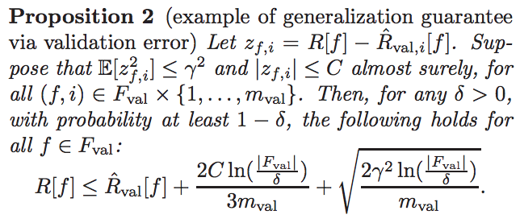

# [Generalization in Deep Learning](https://arxiv.org/pdf/1710.05468.pdf)

by : **Kenji Kawaguchi, Leslie Pack Kaelbling, Yoshua Bengio (MIT, University of Montreal)**

## tl;dr

Explores why DL generalizes well despite being instable, nonrobust and having sharp minima, with interesting generalization bounds involving validation error. Shows that Deep Learning models learn generalizable patterns before they memorize training data. 

## notes

*Rademacher complexity (primer)*

* a universal estimator has a unitary Rademacher complexity
* intuitively, measures capacity to fit a random label on data sampled from a given probability distribution

**Generalization theory**

Several leads in generalization theory to explain why DL generalizes so well while being able to overfit whole dataset are flawed.

*model complexity*

VC dimension and Rademacher complexity approaches are unsufficient to explain DL generalization because bounds on generalization gap are too broad.

For instance, Rademacher complexity :

* grows exponentially with network depth
* grows linearly with number of trainable params

*stability*

Conjecture :

DL generalization could be explained via stability (in principle). Stability measures how model function (as learned via given algo) is stable to a change in data points.

Not proved up to now.

Drawback : stability is dataset dependent.

*robustness*

Robustness measures the variance of the loss w.r.t the function's input space.

This has flaws due to curse of dimensionality and complex dependances in the number of partitions of the input space.

*flat minima*

Researchers conjectured that generalization was caused by flat minima for loss function. Makes sense intuitively, because means that small perturbations do not impact loss value too much.

But it has been shown that a flat minimum can be turned into sharp one (via reparameterization) without affecting generalization gap.

Needs further investigation.

**Authors' propositions**

*Prop 1*

* overparameterized linear models can memorize any training data 
* WHILE decreasing train and test error close to 0
* WITH arbitrarily large params' norm
* EVEN WITH parameters arbitrarily far from ground truth

Valid for any ML model class, and independent of learning mechanism, model class or flat minima for loss in model param space.

*Prop 2*

If a validation error across several epochs for one or several models of the same model class, this error is guaranteed to generalize well independently of model capacity, stability, robustness and flat minima.

This provides a bound on risk based on the amount of estimations done on the same valid set, its size as well as the worst accuracy and worst expected quadratic risk on valid.

Thus models with consistent good valid perf on a large enough valid set have strong performance guarantees.

