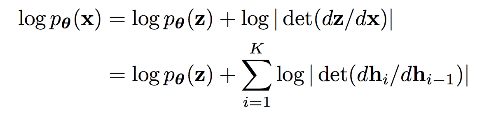
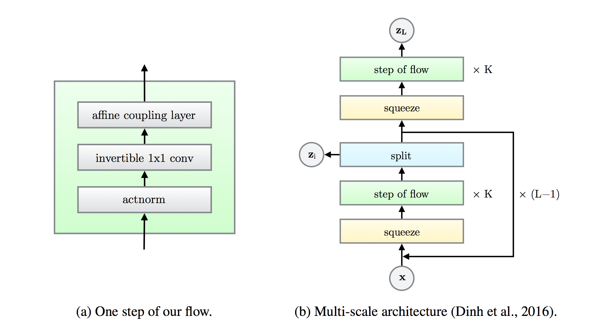
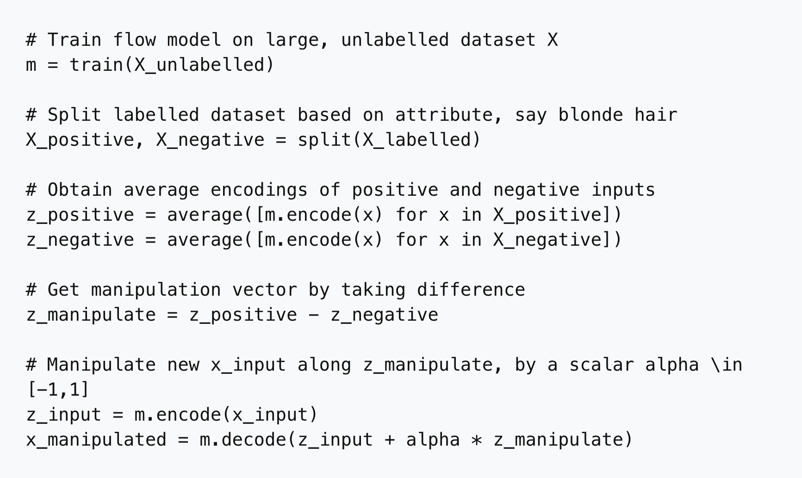
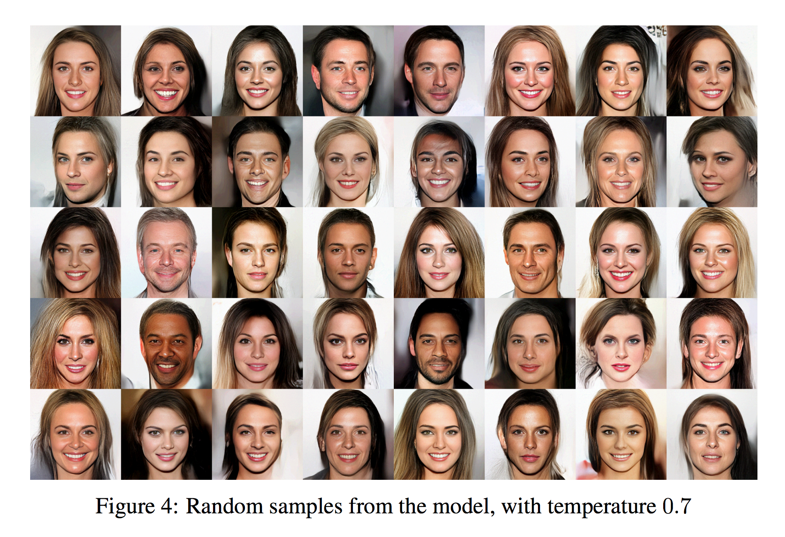
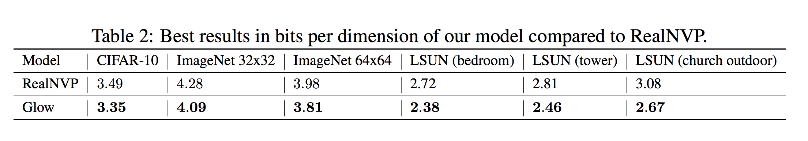

# [Glow : Generative Flow with Invertible 1x1 Convolutions](https://arxiv.org/pdf/1807.03039.pdf)

by : **Diederik P. Kingma, Prafulla Dhariwal (OpenAI)**

## tl;dr

Flow-based generative model (different family than GANs or VAEs) that achieves realistic synthesis of high-resolution images while training on log-likelihood and without using progressive growing.

## Notes

#### Flow-based models

Flow-based models are characterized by an invertible mapping from the latent space to the natural images space (so-called flow). This is particularly useful to interpolate between arbitrary images. GANs cannot map to the latent space by design, and VAEs do not provide exact latent-variable inference (image -> latent vector -> different image).

Flow-based models advantages :

* exact latent-variable inference
* efficient synthesis
* useful latent space for marginal manipulations (old -> young, brune -> blonde)

In a generative setting, the aim is to produce a model that maximizes the log-likelihood of the test data. Log-probas of individual examples are calculated as the sum of the log-proba of their latent vector and the log-determinants of all the Jacobian matrices of intermediate transformations :

where h denote intermediate transformations.

Reminder : the Jacobian matrix is the generalization of the gradient to vector functions.

#### The Glow model

A flow is a sequence of invertible transformations.

Here are the transformations considered for Glow :

**Actnorm**

A modification of batch norm to make it viable for very small minibatches (they use 1-sized minibatches to synthesize high-res images).

Consists in an affine transformation initialized to have per-channel zero mean and unit variance for an initial minibatch of data.

**Invertible 1x1 convolutions**

Convolutions have same amount of input and output channels, so can be considered as extended forms of permutation.

These permutations are necessary to have all channels interact in affine coupling after a sufficient amount of layers.

**Affine coupling**

Invertible transformation that is the modeling workhorse.

Splits an example along the channel dimension and perform an elementwise affine transfo of the first split based on a scale and an offset calculated from the second split.

Final architecture :

#### Latent space manipulation

Having access to binary tags (on CelebA), one can group images presenting a specific attribute (e.g. blonde hair) and calculate their average encoding.

Doing the same for the rest of the images and subtracting the two vectors gives a manipulation vector, a vector along which to push an image to affect this attribute.

Here's the OpenAI snippet to do that :

#### Results

On CelebA-HQ, here is a sample of the images synthesized :

Log-likelihood of Glow versus RealNVP (previous state-of-the-art flow-based modeling) :

#### Code

https://github.com/openai/glow