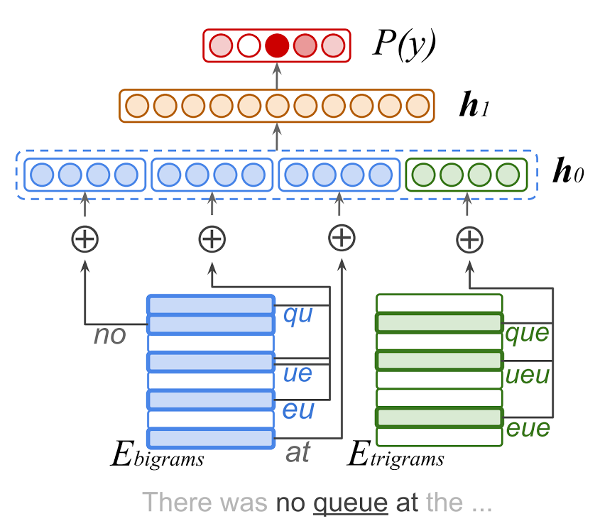

# [NLP with Small Feed-Forward Networks](https://arxiv.org/pdf/1708.00214.pdf) 

by: **Jan A. Botha, Emily Pitler, Ji Ma, Anton Bakalov, 
Alex Salcianu, David Weiss, Ryan McDonald, Slav Petrov (Google)**

## tl;dr
Small and shallow feedforward networks are memory and speed efficient, and perform surprisingly well. 
Using some techniques, they get close to state-of-the-art on structured and unstructured language tasks.

## Notes 

#### Language tasks on a budget

related work :

* 900000 params only for LSTM-based POS tagging model (Gillick et al 2016)
* 8.8 words / s for two-layered LSTM on Android phone for translation (Kim and Rush 2016)

4 tasks adressed here :

* language identification
* POS tagging
* word segmentation (e.g. for chinese where word delimitation is not explicit)
preordering for translation

4 techniques used to get better performance on budgeted models :

* quantization (more dimensions, less precision)
* word clusters (reduce network size, use word clusters and derived features)
* select features (add feature conjunctions)
* pipelines (allocating params for additional task in pipeline)

produces models with less than 3Mb in memory

#### Small Feed-Forward Network Models

**model architecture**

types of discrete features (eg. bigrams, trigrams...) define groups

each group has an embedding matrix Eg

embeddings extracted from groups are concatenated in one vector, which is referred to as the embedding layer output (vectors for bigrams of the same word are summed, while those from other words are concatenated)

1 hidden layer with M hidden units

one softmax layer

memory use is controlled by embeddding matrix sizes

runtime use is controlled by hidden layer size

**hashed feature ngrams**

Character ngrams are used (instead of word embeddings, because require large dictionaries and big dimensions), trained from scratch

The size of the vocabulary Vg is fixed for each group and random feature mixing is used to calculate the embedding for a given ngram 

* means that a ngram is indexed by v = H(x) mod Vg (H being a hash function)
* allows for small vocab sizes (500-1000) and thus smaller feature embeddings (16 coords)

**quantization**

embedding weights are compressed (from 32bits to 8bits) using a non-inversible transformation (linear + ceil) and a scaling factor that has to be stored

weights are dequantized on-the-fly at runtime

**training**

obj. function is crossentropy + L2 reg

exponentially decaying learning rates

hyperoptimization for other hyperparams, with early stopping

#### Experiments

* averaging instead of summing embeddings inside same group and same word
* using Bloom maps to represent word clusters (maps with approximate key-value retrieval)
* casting unseen characters to special symbol for embedding

