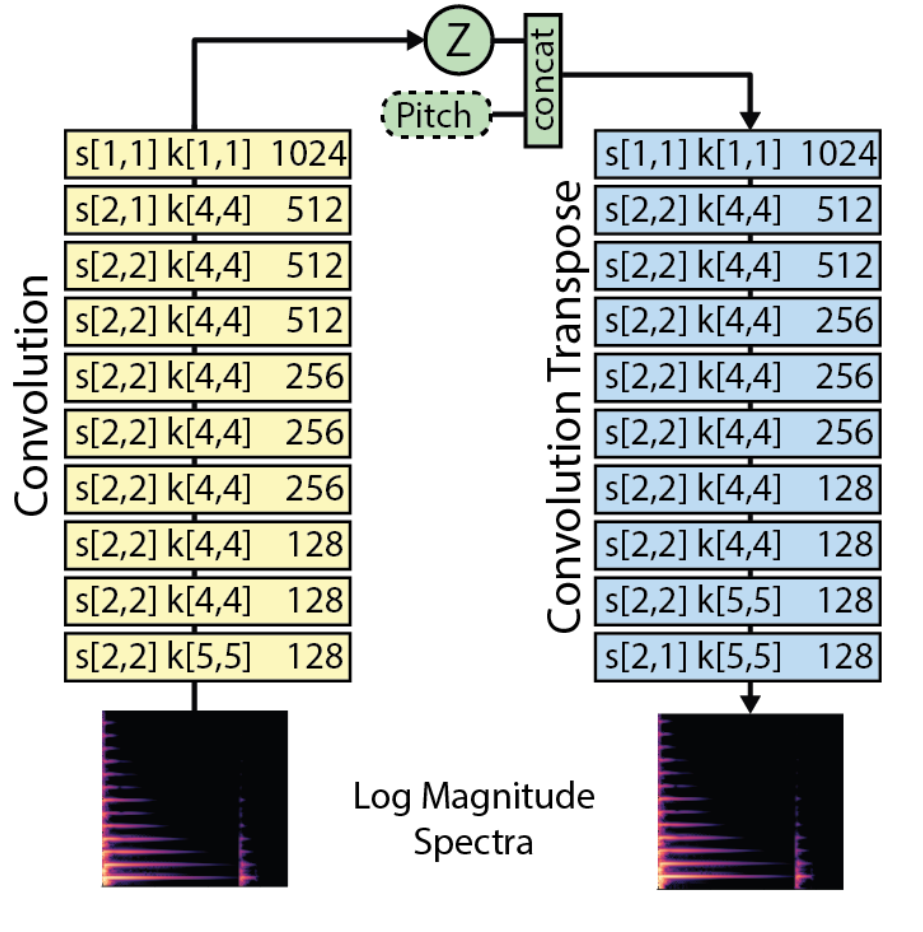
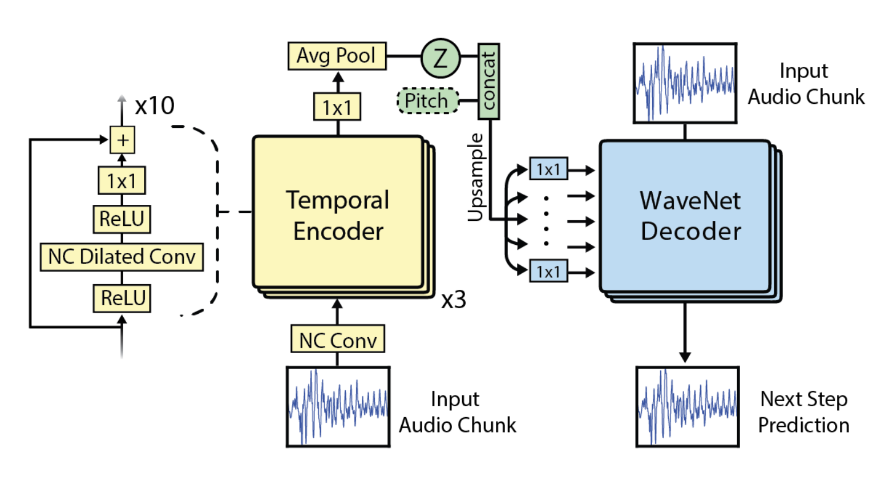
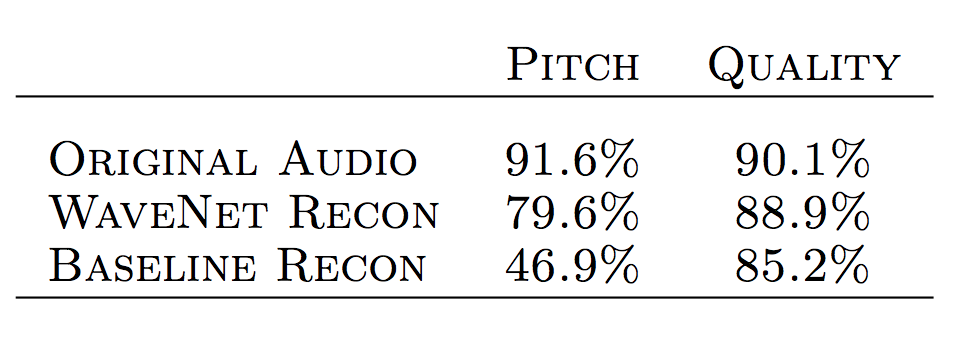

# [Neural Audio Synthesis of Musical Notes with WaveNet Autoencoders](https://arxiv.org/pdf/1704.01279.pdf) 

by: **Jesse Engel, Cinjon Resnick, Adam Roberts, Sander Dieleman, Douglas Eck, Karen Simonyan, Mohammad Norouzi (Google Brain, DeepMind)**

## tl;dr

Image synthesis was made possible thanks to huge high-res datasets such as ImageNet, CelebA... NSynth is a dataset of single notes played by various instruments with a fixed sampling frequency and duration, whose aim is to democratize audio synthesis. The authors develop a WaveNet autoencoder that compares very favorably to a spectral autoencoder baseline on this dataset. 

## Notes

#### Dataset

~300k 16kHz samples of 4s taken from 1000+ instruments from various MIDI libraries, at different pitches and velocities (e.g. strength with which piano key is pressed).

#### Architecture

The 2D-convolutional spectral autoencoder (baseline) :

The WaveNet autoencoder on raw audio waveform (proposed approach):

*NC means Non-Causal. Causal convolutions are 1D-convolutions that stop at the current timestep not to peek into the future.*

In both cases, pitch is hard-encoded as a one-hot vector and concatenated to each timestep of the encoder output fed to the decoder.

While the baseline autoencoder is trained to reproduce its input spectral image, the WaveNet decoder predicts next step based on the audio waveform and the codes. Audio input is quantized to a 8-bit representation.

Codes are 125x16 embeddings, that are upsampled to match the original amount of timesteps via nearest neighbor interpolation. Linear projections of codes are fed at each level in the decoder to condition it.

#### Results

**1. Quality of reconstruction**

Evaluated via a multi-task model that is trained to predict pitch and quality of notes in the original dataset.

**2. Interpolations in latent space**

Interpolations empirically show similarities with both instruments interpolated and have better quality.

#### Code

https://github.com/tensorflow/magenta/tree/master/magenta/models/nsynth