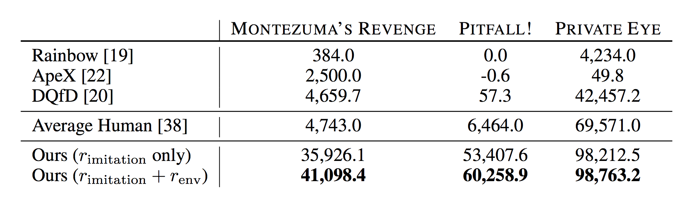

# [Playing Hard Exploration Games by Watching YouTube](https://arxiv.org/pdf/1805.11592.pdf) 

by: **Yusuf Aytar, Tobias Pfaff, David Budden, Tom Le Paine, Ziyu Yang, Nando de Freitas (DeepMind)**

## tl;dr

Leverage knowledge from demonstrations in YouTube videos of playthroughs of games without needing to align videos. Cross-modal embeddings (audio, image) are learned via self-supervised learning tasks that force a network to predict accurately the temporal distance between observations. These embeddings are fed to a IMPALA agent that plays sparsely rewarding games, showing precedently unseen levels of skill. 

## Notes

Deep Q-Learning from Demonstrations achieves good performance on sparse-reward games but needs strong supervision (sequence of action-state from expert).

Here, both audio and images from agent plays and demonstrations are embedded in a shared space thanks to a self-supervision method that consists in classifying the time interval between two samples from the same origin among intervals chosen beforehand.

The embeddings are then used to derive an auxiliary loss that measures the progress of the agent wrt to the demonstrator, based on their distance in the vector space after the same amount of frames.

Embedding in the same space allows to bridge the domain gap (difference in intensity, color, placement of pixels in different videos versus in-game).

Only three videos are used as demonstrations per video game.

#### Embeddings

Network used for image embedding : *3x3 convolutions + BN + ReLU -> fc*

Network used for audio embedding : *1D convolutions on STFT*

Self-supervision tasks considered :

* Temporal Distance Classification (TDC)

From the same video, sample two frames and have the network predict in which bucket the temporal gap between the two frames fall (e.g. [0, 1, 2-10, 10-50, ...] frames).

* Cross-Modal Temporal Distance Classification (CTDC)

Same task with an audio extract and a frame from a single video.

Loss chosen : linear combination of TDC and CTDC.

#### RL process

Reward = imitation reward + game reward.

Imitation reward is defined by the comparison between the agent progress and the demonstrator progress every N frames.

The comparison is done by comparing the inner product of the visual embeddings to a fixed threshold.

#### Results

Consequent improvement on classical RL algorithms and Deep-Q Learning from Demonstrations on sparse reward games, including the notoriously hard Montezuma's Revenge where they reach superhuman performance !

#### Link to videos

https://www.youtube.com/playlist?list=PLZuOGGtntKlaOoq_8wk5aKgE_u_Qcpqhu