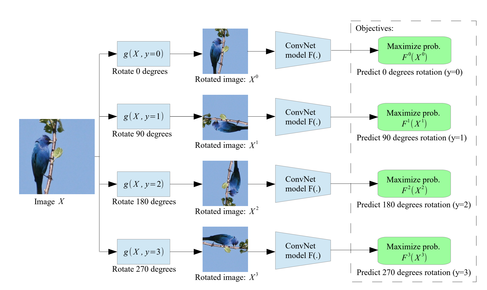
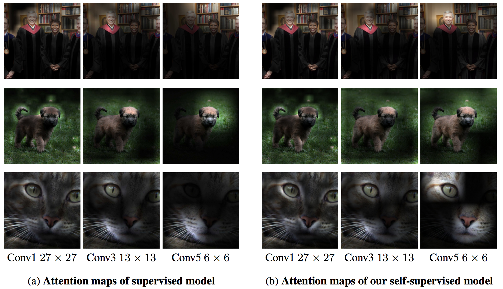
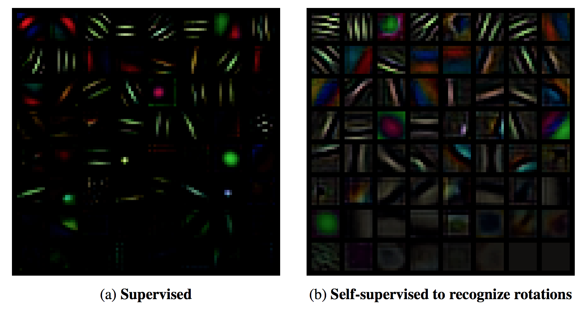
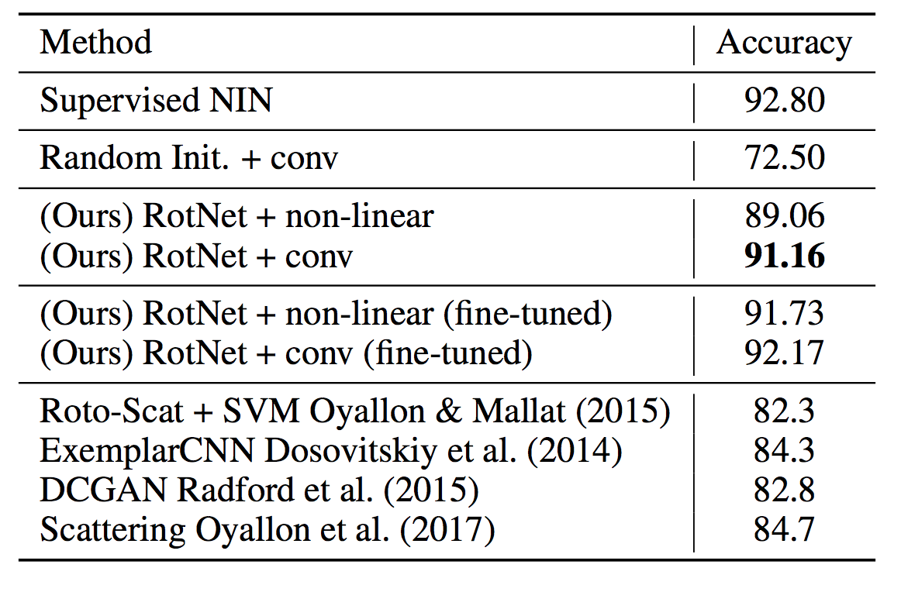

# [Unsupervised Representation Learning by Predicting Image Rotations](https://arxiv.org/pdf/1803.07728.pdf) 

by: **Spyros Gidaris, Praveer Singh, Nikos Komodakis (Université Paris-Est, Ecole des Ponts ParisTech)**

## tl;dr

Demonstrate a strong unsupervised representation learning technique that is remarkably simple : have a ConvNet learn to recognize a simple transformation applied to an image of the dataset. In this case, they use multiples of 90 degrees rotations. 

They argue that rotations are good candidates since recognizing a rotation requires recognizing salient objects and their orientation. The results close the gap between fully-supervised and self-supervised tasks on CIFAR-10 as well as strong performance on self-supervised ImageNet. 

Salient zones for the models are quite similar between the fully and the self-supervised task (which is good) and the feature maps of the first layer of the self-supervised model show more diversity (which is even better). 

## Notes

#### Process

#### Saliency maps and filters

#### Results

Results on CIFAR10, with Supervised NIN being a fully supervised architecture with good performance (92.8% VS 96.5% Fractional Max Pooling, state-of-the-art).

RotNet is based on the same architecture and learns features in an unsupervised way, which are exploited by a last block itself trained with supervision ; it gets remarkably close in performance to its fully supervised counterpart.

#### Code

https://github.com/gidariss/FeatureLearningRotNet