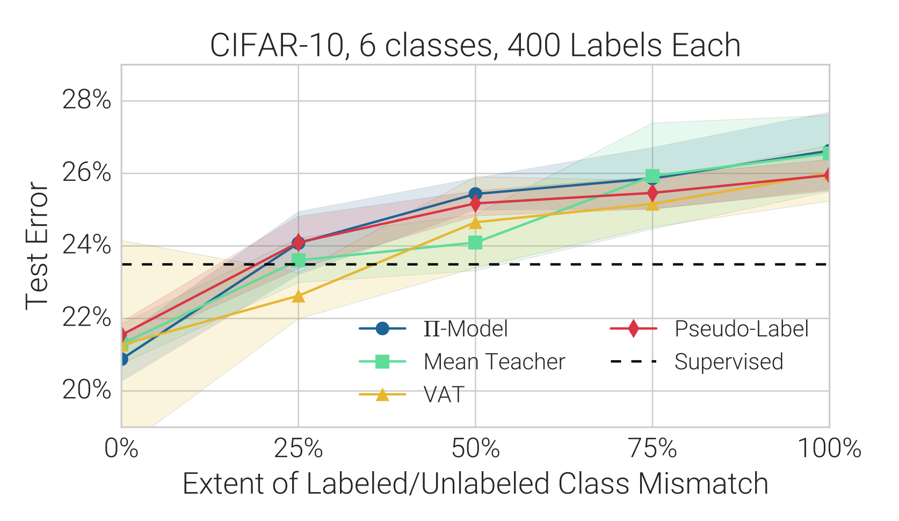
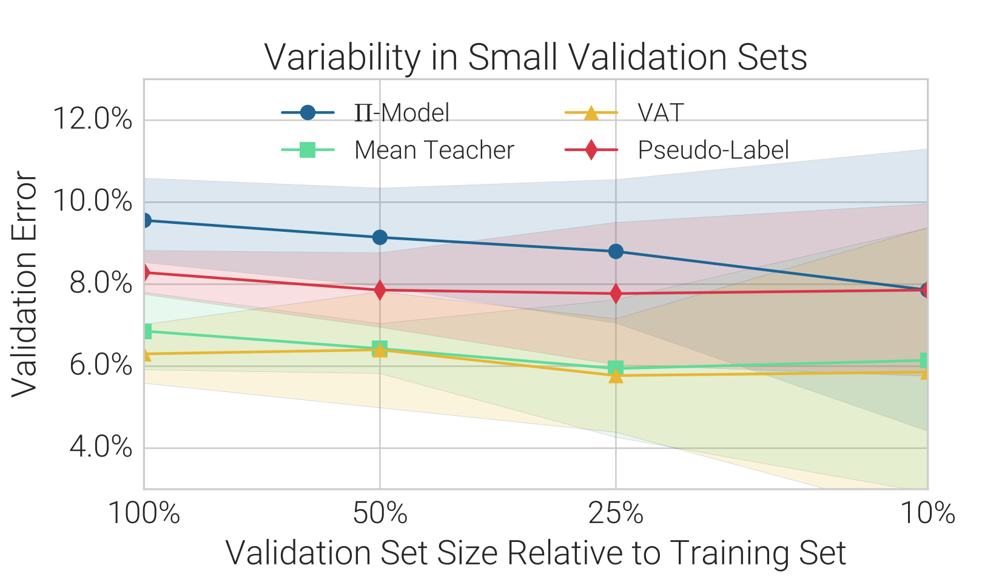

# [Realistic Evaluation of Semi-Supervised Algorithms](https://arxiv.org/pdf/1804.09170.pdf) 

by: **Avital Oliver, Augustus Odena, Colin Raffel, Ekin D. Cubuk, Ian J. Goodfellow (Google Brain)**

## tl;dr

Semi-Supervised Learning (SSL) benchmarks are provably flawed because of a lack of unification in their experimental protocols. The authors reimplement 13 of the most widely used algorithms, show how some of the claims of their original papers are overconfident, and derive proposals for sound SSL research.

## Notes

Here follow a summary of the observed phenomena and the corresponding experimental proposals.

**Unified model**

Proposal : use same architecture when comparing SSL procedures.

**High-quality supervised baseline**

Observed : Baseline is often omitted, and when mentioned, it is underoptimized. That results in overestimated gaps between SSL and supervised learning on the labeled data.

Proposal : Carefully trained supervised baseline with as much hyperoptimization trials than semi-supervised algorithm.

**Comparison to transfer learning**

Observed : TL compares favorably to SSL methods for the network inspected.

Proposal : Compare to model transferred from similar task with large labeled dataset.

**Data distribution mismatch**

Observed (1) : adding data with mismatched classes proportions can actually hurt performance !

Observed (2) : Different methods do not behave similarly when exposed to varying labeled / unlabeled data ratios.

Proposal : 

* Measure evolution of test performance based on difference in label distribution between train / test and when quantity of unlabeled data varies. 
* A good SSL procedure should perform well with few labeled data and different target distributions in train / test.

**Small validation sets**

Observed : Impossible to rank SSL methods based on too small validation sets (like 10% of training set size). Suggests that SSL methods rely on heavy hyperparameter optimization.

Proposal : Keep decent amount of data for validation (not too small / not too big) and do not over-tweak hyperparams. 

#### Conclusion

* Need for more principled experiments when designing SSL algorithms.
* Mean Teacher and Virtual Adversarial Training are two solid SSL methods !

#### Code (not open sourced yet)

https://github.com/brain-research/realistic-ssl-evaluation