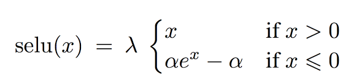

# [Self-Normalizing Networks](https://arxiv.org/pdf/1706.02515.pdf) 

by: **Günter Klambauer, Thomas Unterthiner, Andreas Mayr, Sepp Hochreiter (LIT AI Lab & Institute of Bioinformatics)**

## tl;dr

No performances breakthroughs with neural nets on structured data (while CNNs and RNNs crush other models on images and sequential data). SNNs proposed with SELUs (scaled exponential linear units) as activation. Highly robust and deep models that outperform concurrence on 121 ML tasks from UCI ML repo.

## Notes 

(feed-forward networks = MLPs = FNNs)

State-of-the-art FNNs often don’t get deeper than 4 layers.

FNNs are perturbed by normalization techniques and have high variance on training error (not the case for CNNs and RNNs thanks to weight sharing).

SNNs don’t have these drawbacks thanks to self-normalization induced by their activation.

A layer is considered normalized if mean and var of activations belong in a given range (fixed beforehand).

Self-normalization property -> transitive/conservation property : if layer is normalized, next layer is normalized as well.

#### Scaled Exponential Linear Unit (SELU)

Requirements for the activation :

* must have positive and negative values (to control mean)
* saturation regions (derivatives asymptotically close to 0) (to dampen variance)
* slope larger than one (to increase variance if too small in previous layer)
* continuous

is equivalent to an ELU with a multiplicative coefficient to ensure slope larger than 1

#### Initialization scheme

weight init :

* zero mean
* unitary sum of squares

In practice, drawn from a Gaussian distribution with zero mean and 1/N variance (N being the amount of elements in the previous layer).

#### Alpha Dropout

Dropout randomly puts activations in the 0-derivative zone of the activation function not to backpropagate any signal through these deactivated neurons.

Based on the SELU activation (whose 0-derivative zone is towards -infinity), dropout must be adapted by setting neurons to the limit of the SELU function.

Dropout preserves the mean of a layer's activations by rescaling the activations (multiplying by 1 / q durig training).

To keep that property, we must rescale and reshift the activations by values derived from the mean and variance conservation constraints. 

**work in progress...**
