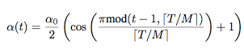
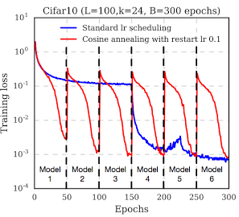

# [Snapshot Ensembles : Train 1, get M for free](https://arxiv.org/pdf/1704.00109.pdf)

by: **Gao Huang, Yixuan Li, Geoff Pleiss, Zhuang Liu, John E. Hopcroft, Kilian Q. Weinberger (Cornell University, Tsinghua University)**

## tl;dr
Ensembling is good for performance but training several NNs is expensive and time-consuming. Proposes a way to ensemble multiple NNs at the cost of only training one : network structure is saved when reaching local minima along its path in parameter space. 

Rapid convergence is obtained via cyclic learning rates.

## Notes 

Local minima contain useful information -> some are good, some are worse for generalization.

Kaskar et al, 2016 :

* local minima with flat basins generalize better
* SGD with small batch size escapes from sharp local minima due to noisy gradient estimation
* small learning rate -> model tends to converge to closest local minimum

He et al, 2016b :

* learning rate is kept high in the beginning (to move towards flat local minimum)
* then (when perf. does not evolve) lr is dropped to trigger descent to local minimum

Local minima often have similar error rates, but do not perform same mistakes on data
-> diversity that can be exploited through ensembling

Idea : each time NN converges to local minimum, save parameters and go back to large learning rate to escape minimum, then lower again.

*cyclic annealing*

* lower learning rate quickly but high starting point
* shifted cosine function used (with max lr alpha0 = 0.1 ou 0.2) :

(see [Loschilov & Hutter, 2016](https://arxiv.org/pdf/1608.03983.pdf) for more info about cyclic learning rates)

At test time, ensemble m last models seen during training.
