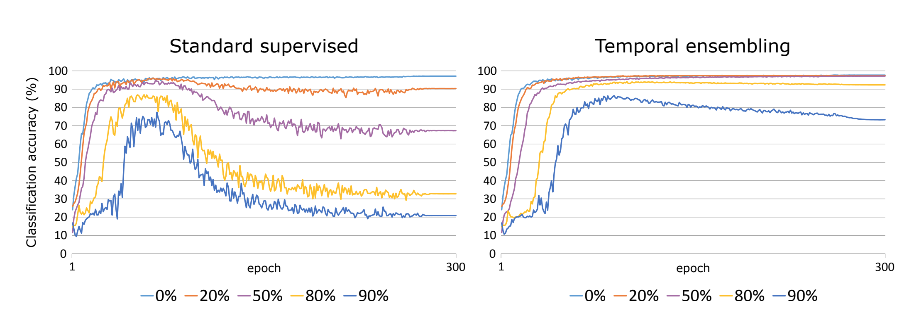

# [Temporal Ensembling for Semi-Supervised Learning](https://arxiv.org/pdf/1610.02242.pdf)

by: **Samuel Laine, Timo Aila (NVIDIA)**

## tl;dr

New method for semi-supervised learning that relies on a simpler mechanism than previous work (e.g. Ladder Networks) and improves on state-of-the-art.

## Notes

Dropout, Dropconnect, Stochastic Depth and Swapout are not only forms of regularization but of implicit ensembling since specific parts of the network are trained independently.

Swapout Networks : each unit has access to a random subset of the units of ALL previous layers

#### Basic components

* Stochastic augmentation : Gaussian noise + probabilistic flips / rotations / translations
* Weight ramp-up function : time-dependent weight function that starts at zero and increases along Gaussian curve

#### P-model

During training, uses two forward passes with two different dropout and augmentation parameterizations and constrains output of both passes to be close (wrt to MSE), which can be interpreted as a variance constraint.

Traditional learning instead focuses on fixing classification.

Comparison to Ladder Networks :

* conceptually simpler
* no auxiliary mapping or loss
* two equally transformed passes (not clean VS noisy as in Ladder Nets)

#### Temporal Ensembling

Pros :

* targets are less noisy
* ~2x speedup over P-model
* almost always more powerful

Con :

* memory-intensive

Similar to P-model unless that only one forward pass is needed : the reference output needed by variance constraint is derived from an ensembling of the outputs of previous model snapshots (with a momentum-like weight mechanism).

Ensembling reduces noise in the reference output.

A bias correction is applied to the ensemble to counterweight the effect of the zero initialization (demonstration in [Adam paper](https://arxiv.org/pdf/1412.6980.pdf)).

##### Resistance to incorrect labels 

Pretty impressive. They randomly corrupted a ratio of the labels of the supervised samples and studied the effect on performance.

They suggest that this is due to the training procedure (especially the unsupervised component) constraining the decision function to be flat in the vicinity of samples, allowing correctly labelled neighbors to help counter the corruption. 

#### Experiments

Improves state-of-the-art on CIFAR-10 and SVHN, sets it on CIFAR-100 :

* CIFAR-10 : from 18% to 12% error rate (4000 labels)
* SVHN : from 18% to 5% (500 labels)
* CIFAR-100 : 38% (10000 labels)

ZCA whitening (for Zero Components Analysis) is a transform that decorrelates all the variables in a dataset matrix. It can be interpreted as a geometric transform, rotating the matrix to the space of its eigenvectors, dividing each principal component by its stddev in that direction, and rotate back to the original space. Performed multiplying X by (XXt)^(-1/2). 
