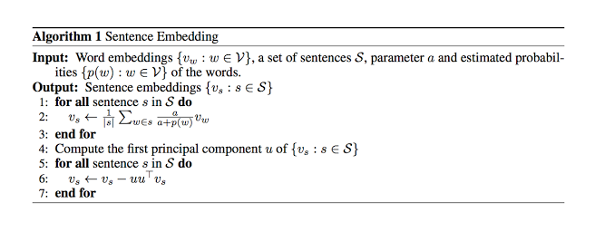

# [A Tough to Beat Baseline for Sentence Embeddings](https://openreview.net/pdf?id=SyK00v5xx)

by: **Sanjeev Arora, Yingyu Liang, Tengyu Ma (Princeton University)**

## tl;dr
Make basic unsupervised sentence embeddings (= weighted average of word embeddings) smarter with fixed weights and a very simple embedding update using SVD.

## Notes

#### Weights

Word weights = $$\frac{a}{a + p(w)}$$ where $a$ is a fixed param and $p(w)$ the estimated word frequency. 

This weighting is called Smooth Inverse Frequency (SIF). The $a$ param is to be learned but a wide range of values outperform the weighted average baseline which uses TF-IDF.

#### Sentence embedding update

Common component removal : remove the projections of the sentence vectors on their 1st principal component to improve performance. 

As I understand it, this principal component can be interpreted as a common discourse vector, thus the projection of a sentence embedding does not convey specific information about the sentence and can be discarded.

#### The algorithm

#### Related work

1. unweighted averaging works well for small sentences
2. coordinate-wise multiplication of word vectors works well !