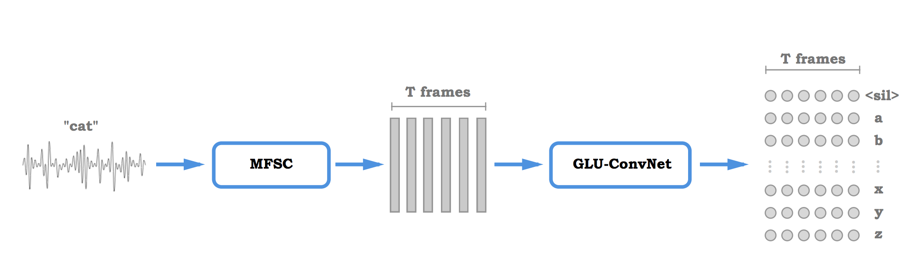
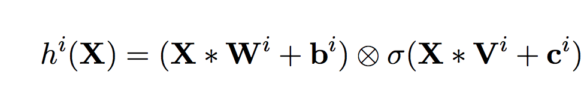

# [Letter-Based Speech Recognition with Gated ConvNets](https://arxiv.org/pdf/1712.09444.pdf)

by: **Vitaliy Liptchinsky, Gabriel Synnaeve, Ronan Collobert (Facebook AI Research)** 

## tl;dr

End-to-end letter-based speech recognition system based on log-mel coefficients, a ConvNet acoustic model and a standard decoder. Shows near state-of-the-art performance without additional training data.

## notes

Standard speech recognition system :

* additional training data (often a lot more than what the original dataset)
* complex pipeline
* needs phonetic transcription for training data

The system proposed :

* trains only on dataset provided samples
* end-to-end
* uses graphemes (letters) directly

### The architecture

##### Log-mel filterbanks

Log-mel filterbanks are computed from each frame of the spectrogram associated to the input signal. Basically these are spectrogram coefficients rescaled using mel-scale, which was designed following how the human ear perceives sound. This rescaling has an interesting property : it is more robust to small time-warping deformations.

##### Acoustic model

The acoustic model takes as input log-mel filterbanks and outputs probabilities across all letters available for each frame.

Each input feature sequence is ZMUV normalized.

The convolution blocks are 1D convolutions with Gated Linear Units : 1d convolutions are performed along the time axis and their result is elementwise multiplied by another 1d convolution (with identical kernel size) that is this time fed to a nonlinearity (a sigmoid) :

Zero padding is applied to the input in a way that the final output has as many frames as the input before padding.

##### The loss function

A primer on CTC (Connectionist Temporal Classification) :

* aim : computing a differentiable p(Y | X) when the alignment between frames and outputs is not known
* characteristics : a blank symbol is used for transition frames
* process : uses dynamic programming to sum the probabilities of all valid sequences of letters (wrt to expected output), the probability of one sequence of letters being the product of all single frame-letter probabilities

Instead of using CTC, they use ASG which is a simplified version of CTC. The blank symbol is discarded and replaced by digits that indicate the amount of repetitions of the previous element.

Unnormalized version of ASG ?

##### The decoder

Decoding via beam search (breadth-first search with sorting and fixed size pruning)

##### The tricks

Weight norm + gradient clipping

High dropout (p=0.6) on output activations gives better results on both tests

### The results

Comparable results to DeepSpeech 2 (from Baidu Research) which uses RNNs + convolutions and is thus way more computationally intensive (better on clean input, worse on noisy input)

 